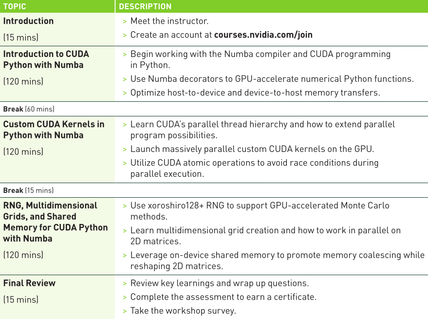
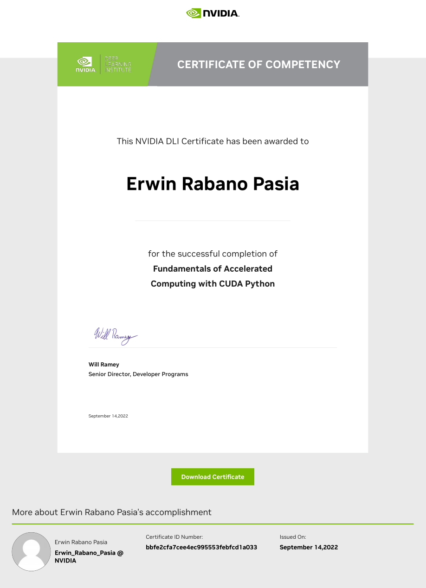

# [NVIDIA DLI - Technical Workshop for Fundamentals of Accelerated Computing with CUDA Python](https://learn.nvidia.com/courses/course-detail?course_id=course-v1:DLI+C-AC-02+V1) - COMPLETED!

**The Learning Objectives are:**

At the conclusion of the workshop, you’ll have an understanding of the fundamental tools and techniques for
GPU-accelerated Python applications with CUDA and Numba:

1. GPU-accelerate NumPy ufuncs with a few lines of code.
2. Configure code parallelization using the CUDA thread hierarchy.
3. Write custom CUDA device kernels for maximum performance and flexibility.
4. Use memory coalescing and on-device shared memory to increase CUDA kernel bandwidth.
5. Generate random numbers on the GPU.
6. Learn intermediate GPU memory management techniques.

## Instructor-Led Workshop Outline:

    

## [Certificate Of Competency:](https://learn.nvidia.com/certificates?id=bbfe2cfa7cee4ec995553febfcd1a033)

    

